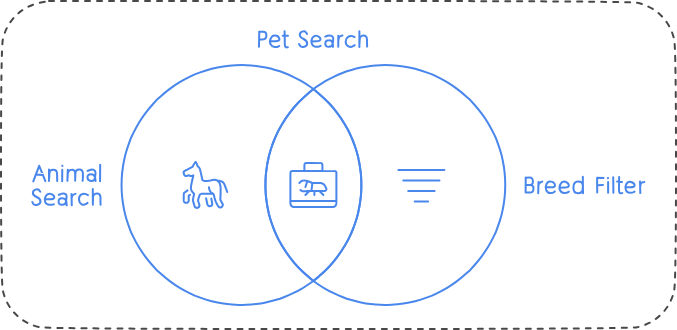

# Pet Adoption Website

This project is a pet adoption website built using React, allowing users to search for pets based on the type of animals and associated breeds.

## Features

-   **Search by Animal Type**: Users can search for pets based on the type of animals such as dogs, cats, birds, etc.
-   **Filter by Breed**: Users can further filter their search results by selecting specific breeds within the chosen animal type.
-   **Responsive Design**: The website is responsive and works well across various devices and screen sizes.
    <br><br>
    

## Getting Started

To get a local copy up and running follow these simple steps:

1.  **Clone the repository:**

    ```bash
    git clone https://github.com/pravinkori/adpot-me-pet.git
    ```

2.  **Navigate into the project directory:**

    ```bash
    cd adpot-me-pet
    ```

3.  **Install dependencies:**

    ```bash
    npm install
    ```

4.  **Run the development server:**
    ```bash
    npm run dev
    ```
5.  **Open your browser and visit:**

            ```bash
            http://localhost:5173/
            ```

    <br>

    
